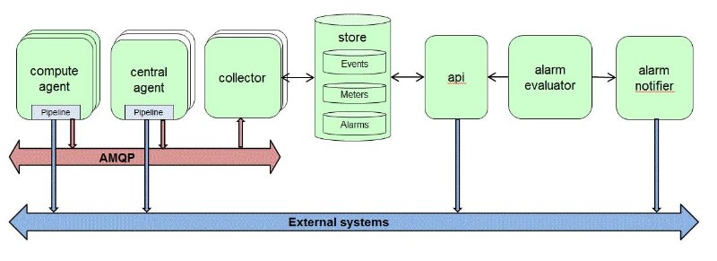
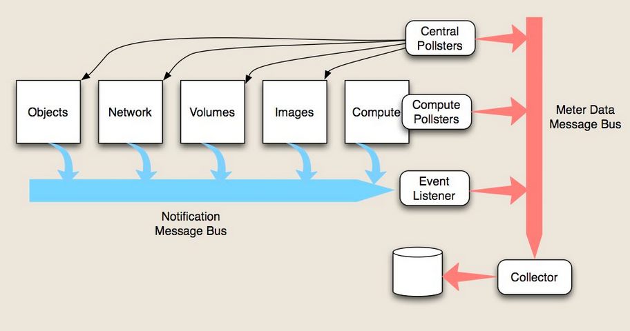

## Ceilometer

### Architecture


Ceilometer使用了两种收集数据的方式，一种是消费OpenStack各个服务内发出的notification消息(对应上图中的蓝色箭头)，一种 是通过调用各个服务的API去主动的获取数据(对应上图中的黑色箭头)。

Ceilometer由5个重要的组件以及一个Message Bus组成
1. **Compute Agent**
该组件用来收集计算节点上的信息，在每一个计算节点上都要运行一个Compute Agent，该Agent通过Stevedore管理了一组pollster插件， 分别用来获取虚拟机的CPU, Disk IO, Network IO, Instance这些信息，值得一提的是这些信息大部分是通过调用Hypervisor的API来获取的， 目前，Ceilometer仅提供了Libvirt的API。
2. **Central Agent**
Central Agent运行在控制节点上，它主要收集其它服务(Image, Volume, Objects, Network)的信息，实现逻辑和Compute Agent类似，但是 是通过调用这些服务的REST API去获取这些数据的。
3. **Collector**
这个应该是最为核心的组件了，它的主要作用是监听Message Bus，将收到的消息以及相应的数据写入到数据库中，它是在核心架构中唯一一个 能够对数据库进行写操作的组件。除此之外，它的另一个作用是对收到的其它服务发来的notification消息做本地化处理，然后再重新发送到 Message Bus中去，随后再被其收集。
目前，通过上面三个组件可以收集到的数据，参看这里。
4. **Storage**
数据存储现在支持MongoDB, MySQL, Postgresql和HBase，现在H3又新增加了对DB2的支持，其中MongoDB是支持最好的。
5. **REST API**
像其它服务一样，Ceilometer也提供的是REST API，API是唯一一个能对数据库进行读操作的组件，虽然后来加入的Alarm API能够直接对数据库 进行读写，但是Alarm应该是一个较为独立的功能，并且它的读写量也不大
6. **Message Bus**
Message Bus是整个数据流的瓶颈，所有的数据都要经过Message Bus被Collector收集而存到数据库中，目前Message Bus采用RabbitMQ实现。
7. **Pipeline**
Pipeline虽然不是其中一个组件，但是也是一个重要的机制，它是Agent和Message Bus以及外界之间的桥梁，Agent将收集来的数据发送到pipeline中， 在pipeline中，先经过一组transformer的处理，然后通过Multi Publisher发送出去，可以通过Message Bus发送到Collector，或者是发送到其它的 地方。Pipeline是可配置的，Agent poll数据的时间间隔，以及Transformers和Publishers都是通pipeline.yaml文件进行配置。
整体上看，Ceilometer对数据流的处理，给人一种大禹治水的感觉。

### Plugin
Ceilometer实现的Plugin框架依赖setuptools的Dynamic Discovery of Services and Plugins实现。这是Ceilometer能进行扩展的基础。Ceilometer中有四种类型的Plugin：Poller，Publisher，Notification和Transformer。
*Poller主要负责被Agent调用去查询数据，返回Counter类型的结果给Agent框架；
*Notification负责在MQ中监听相关topic的消息（虚拟机创建等），并把他转换成Counter类型的结果给Agent框架。
*Transformer负责转换Counter（目前在代码中还没有发现具体用li）
*Publisher负责将Agent框架中Counter类型的结果转换成消息（包括签名），并将消息发送到MQ；


**meter**
计量值，被跟踪资源的测量值。一个实例有很多的计量值，比如实例运行时长、CPU使用时间、请求磁盘的数量等。在Ceilometer中有三种计量值：
*Cumulative: 累计的，随着时间增长(如磁盘读写)
*Gauge: 计量单位，离散的项目(如浮动IP，镜像上传)和波动的值(如对象存储数值)
*Delta: 增量，随着时间的改变而增加的值(如带宽变化)

Host -- Resource -- Meter -- Samples -- statistics
主机 -- 资源 -- 测量参数 -- 样本数据 -- 统计数据

### ceilometer中的服务组件
在I版的ceilometer的各个服务组件启动是在/ceilometer/cli.py中实现的，而在J版中，是在实体包/celiometer/cmd中实现的。结合配置文件setup.cfg中的内容，可见主要有以下几个服务组件：
```ini
console_scripts = 
    ceilometer-api = ceilometer.cli:api
    ceilometer-agent-central = ceilometer.cli:agent_central
    ceilometer-agent-compute = ceilometer.cli:agent_compute
    ceilometer-agent-notification = ceilometer.cli:agent_notification
    ceilometer-send-sample = ceilometer.cli:send_sample
    ceilometer-dbsync = ceilometer.cli:storage_dbsync
    ceilometer-expirer = ceilometer.cli:storage_expirer
    ceilometer-collector = ceilometer.cli:collector_service
    ceilometer-alarm-evaluator = ceilometer.cli:alarm_evaluator
    ceilometer-alarm-notifier = ceilometer.cli:alarm_notifier
    ceilometer-ipmi-service = ceilometer.cli:ipmi_service
```


### Alarm
ceilometer-alarm-notifier 加载并启动AlarmNotifierService服务，实现报警器被触发的相关通知服务；

ceilometer-alarm-evaluator 实现加载并启动报警服务，ceilometer中实现的系统报警服务有两种，即单例报警系统SingletonAlarmService和分布式报警系统

类AlarmService：报警服务实现的基类；
类SingletonAlarmService：单例报警系统服务；
类PartitionedAlarmService：分布式报警器系统服务；
类AlarmNotifierService：报警器被触发的通知服务实现；

#### ceilometer-alarm-notifier
这个组件服务所实现的功能是，当报警器被触发之后，发送相关的通知操作

**初始化**
```python
def alarm_notifier():  
    # 初始化并启动AlarmNotifierService服务（报警器被触发的通知服务）
    service.prepare_service()  

    # launch：加载并启动指定的服务，最终调用了服务的start方法实现服务的启动； 
    # AlarmNotifierService：报警器被触发的通知服务实现； 
    # AlarmNotifierService()：获取类AlarmNotifierService的实例化对象，并实现加载EXTENSIONS_NAMESPACE对应的所有插件； 
    os_service.launch(alarm_service.AlarmNotifierService(
        cfg.CONF.host, 'ceilometer.alarm')).wait()
```

```python
class AlarmNotifierService(rpc_service.Service):  
    def __init__(self, host, topic):  
        ...
```
实现AlarmNotifierService类的初始化操作，在类的初始化过程中会加载命名空间ceilometer.alarm.notifier所定义的所有插件，确定所有实现通知操作的实现方式.

**启动**
```python
class AlarmNotifierService(rpc_service.Service):  
    def start(self):  
        ...
```
服务的启动，为RPC通信建立到信息总线的连接；
    1.建立指定类型的消息消费者；
    2.执行方法initialize_service_hook，建立一个'topic'类型的消息消费者；
    3.启动协程实现等待并消费处理队列中的消息；

```python
class Service(service.Service):  
    def start(self):  
        ...
```
```python
class AlarmNotifierService(rpc_service.Service): 
    def initialize_service_hook(self, service):  
        ...
```

AlarmNotifierService中的方法notify_alarm是具体实现报警器触发后的发送通知操作的具体方法，当报警器被触发之后，都会调用这个方法，主要实现了以下内容：
    遍历所有要通知报警器被触发的URL，针对每个要通知的URL地址，实现：
    1 获取系统所采用的消息通信方式；
    2 通过HTTP/HTTPS协议POST方法实现发送相关报警器被触发的通知（到action指定的URL），（or）通过日志记录相关报警器被触发的通知；
_handle_action
notifier.notify

#### ceilometer-alarm-evaluator
**初始化**
```python
def alarm_evaluator():
    # 加载并启动SingletonAlarmService服务（单例报警服务）； 
    # 报警服务系统：SingletonAlarmService和PartitionedAlarmService； 
    # 默认报警服务：ceilometer.alarm.service.SingletonAlarmService； 
    # 如果要应用分布式报警系统，则需要在这里修改配置文件中的参数； 
    service.prepare_service()
    # launch：加载并启动SingletonAlarmService服务，最终调用了服务的start方法实现服务的启动； 
    # 配置文件定义了默认报警服务：ceilometer.alarm.service.SingletonAlarmService 
    # SingletonAlarmService：单例的报警服务； 
    eval_service = importutils.import_object(cfg.CONF.alarm.evaluation_service)
    os_service.launch(eval_service).wait()
```

*SingletonAlarmService初始化*
```python 
class SingletonAlarmService(AlarmService, os_service.Service):  
    def __init__(self):  
        ...
```
类SingletonAlarmService的初始化操作主要完成了两部分内容：
+ 加载命名空间ceilometer.alarm.evaluator中的所有插件；
```ini
ceilometer.alarm.evaluator =
    threshold = ceilometer.alarm.evaluator.threshold:ThresholdEvaluator
    combination = ceilometer.alarm.evaluator.combination:CombinationEvaluator
```
  即描述了报警器状态的评估判定的两种模式：联合报警器状态评估和单一报警器状态评估；
+ 建立线程池，用于后续报警器服务中若干操作的运行；

```python
class Service(object):  
    def __init__(self, threads=1000):  
        ...
```

```python
class AlarmService(object):  
    EXTENSIONS_NAMESPACE = "ceilometer.alarm.evaluator"  
  
    def _load_evaluators(self): 
        ...
```
这里得到的就是加载命名空间ceilometer.alarm.evaluator中的所有插件； 
```ini
ceilometer.alarm.evaluator = 
threshold = ceilometer.alarm.evaluator.threshold:ThresholdEvaluator 
combination = ceilometer.alarm.evaluator.combination:CombinationEvaluator 
```

*SingletonAlarmService启动*
类的启动操作实现了单例报警器服务SingletonAlarmService的启动操作
按照一定时间间隔实现循环执行方法self._evaluate_assigned_alarms，方法self._evaluate_assigned_alarms实现获取alarm集合，针对每一个报警器，实现根据报警器模式的类型（threshold和combination），来实现单一报警器模式或者联合报警器模式的评估判定；
```python
class SingletonAlarmService():
    def start(self): 
        ...
        self.tg.add_timer(  
            interval,  
            self._evaluate_assigned_alarms,  
            0)  
```
按照一定时间间隔实现循环执行方法self._evaluate_assigned_alarms

```python
class AlarmService():
    def _evaluate_assigned_alarms():
        ...
```
这个方法实现获取当前部分的所有报警器，对每一个报警器进行报警触发的评估判定
_assigned_alarms   获取分配给当前部分的报警器
_evaluate_alarm    报警器状态的评估判定

*PartitionedAlarmService初始化*
PartitionedAlarmService类初始化操作和SingletonAlarmService类初始化操作内容大致是相同的，同样主要完成了两部分内容：
    * 加载命名空间ceilometer.alarm.evaluator中的所有插件；
    * 建立线程池，用于后续报警器服务中若干操作的运行；
    * 初始化分布式报警协议实现类PartitionCoordinator；
```python
class PartitionedAlarmService(AlarmService, rpc_service.Service):  
    def __init__(self): 
        ...
```

```python
class Service(object):  
    def __init__(self, threads=1000):  
        ...
```

```python
class AlarmService(object):    
    def _load_evaluators(self):  
        ...
```
加载命名空间ceilometer.alarm.evaluator中的所有插件
```ini
ceilometer.alarm.evaluator = 
threshold = ceilometer.alarm.evaluator.threshold:ThresholdEvaluator 
combination = ceilometer.alarm.evaluator.combination:CombinationEvaluator 
```
*PartitionedAlarmService启动*
分布式报警器系统服务分布式报警器系统服务的启动和运行，按照一定的时间间隔周期性的执行以下操作：
1.实现广播当前partition的存在性的存在性到所有的partition（包括uuid和优先级信息）；
2.实现定期检测主控权角色；确定当前的partition是否是主控角色；
  如果为拥有主控权的partition，则根据不同的情况实现不同形式的报警器分配操作；
  情况1：所有报警器都要实现重新分配操作；
  情况2：只有新建立的报警器需要实现分配操作；
3.获取alarm集合，对每一个alarm,调用_evaluate_alarm方法;
  针对每一个报警器，实现根据报警器的类型（threshold和combination），来实现：
  单一报警器模式或者联合报警器模式的评估判定；
```python
class PartitionedAlarmService
    def start:
        ...
```

```python
class Service(service.Service):  
    def start(self):  
```

在上面的分析中，我们看到在服务初始化和启动的过程中，若干方法都是多重父类继承，这里需要注意的是父类方法的搜索顺序；实际上python经典类的父类方法搜索顺序是深度优先，而python新式类的父类方法搜索顺序是广度优先；


### ceilometer-agent-central服务的初始化和启动


##### clear_expired_metering_data
先找出所有符合条件的sample，然后再循环删除，如果数据量比较大，会占用比较多的内存空间。改为逐个删除，要先删除外键关联表，最后再删除sample表。
metadata_text
metadata_float
metadata_int
metadata_bool
source, sourceassoc
sample
```log
2015-11-24 09:44:09.837 23391 INFO sqlalchemy.engine.base.Engine [-] SELECT metadata_text.id AS metadata_text_id, metadata_text.meta_key AS metadata_text_meta_key, metadata_text.value AS metadata_text_value
FROM metadata_text
WHERE %s = metadata_text.id
2015-11-24 09:44:09.839 23391 INFO sqlalchemy.engine.base.Engine [-] (95148L,)
2015-11-24 09:44:09.850 23391 INFO sqlalchemy.engine.base.Engine [-] SELECT metadata_float.id AS metadata_float_id, metadata_float.meta_key AS metadata_float_meta_key, metadata_float.value AS metadata_float_value
FROM metadata_float
WHERE %s = metadata_float.id
2015-11-24 09:44:09.854 23391 INFO sqlalchemy.engine.base.Engine [-] (95148L,)
2015-11-24 09:44:09.862 23391 INFO sqlalchemy.engine.base.Engine [-] SELECT metadata_int.id AS metadata_int_id, metadata_int.meta_key AS metadata_int_meta_key, metadata_int.value AS metadata_int_value
FROM metadata_int
WHERE %s = metadata_int.id
2015-11-24 09:44:09.870 23391 INFO sqlalchemy.engine.base.Engine [-] (95148L,)
2015-11-24 09:44:09.882 23391 INFO sqlalchemy.engine.base.Engine [-] SELECT metadata_bool.id AS metadata_bool_id, metadata_bool.meta_key AS metadata_bool_meta_key, metadata_bool.value AS metadata_bool_value
FROM metadata_bool
WHERE %s = metadata_bool.id
2015-11-24 09:44:09.885 23391 INFO sqlalchemy.engine.base.Engine [-] (95148L,)
2015-11-24 09:44:09.898 23391 INFO sqlalchemy.engine.base.Engine [-] BEGIN (implicit)
2015-11-24 09:44:09.902 23391 INFO sqlalchemy.engine.base.Engine [-] SELECT source.id AS source_id
FROM source, sourceassoc
WHERE %s = sourceassoc.sample_id AND source.id = sourceassoc.source_id
2015-11-24 09:44:09.906 23391 INFO sqlalchemy.engine.base.Engine [-] (95148L,)
2015-11-24 09:44:09.912 23391 INFO sqlalchemy.engine.base.Engine [-] DELETE FROM sourceassoc WHERE sourceassoc.sample_id = %s AND sourceassoc.source_id = %s
2015-11-24 09:44:09.916 23391 INFO sqlalchemy.engine.base.Engine [-] (95148L, 'hardware')
2015-11-24 09:44:09.926 23391 INFO sqlalchemy.engine.base.Engine [-] DELETE FROM metadata_text WHERE metadata_text.id = %s AND metadata_text.meta_key = %s
2015-11-24 09:44:09.927 23391 INFO sqlalchemy.engine.base.Engine [-] ((95148L, 'resource_id'), (95148L, 'resource_url'))
2015-11-24 09:44:09.932 23391 INFO sqlalchemy.engine.base.Engine [-] DELETE FROM sample WHERE sample.id = %s
2015-11-24 09:44:09.934 23391 INFO sqlalchemy.engine.base.Engine [-] (95148L,)
2015-11-24 09:44:09.938 23391 INFO sqlalchemy.engine.base.Engine [-] COMMIT
```


#### Ceilometer二次开发
ceilometer/api/controllers/v2.py
变量名即为rest中的路径
```python
class V2Controller(object):
    resources = ResourcesController()
    meters = MetersController()
    samples = SamplesController()
    ...
```

Controller
继承RestController，使用expose对外暴露方法
pecan.request.storage_conn.get_resources() 对应storage中对应的方法（ceilometer/storage/impl_sqlalchemy.py），从数据库中获取数据
```
class ResourcesController(rest.RestController):
    @wsme_pecan.wsexpose(Resource, unicode)
    def get_one(self, resource_id):
        authorized_project = acl.get_limited_to_project(pecan.request.headers)
        resources = list(pecan.request.storage_conn.get_resources(
            resource=resource_id, project=authorized_project))
        if not resources:
            raise EntityNotFound(_('Resource'), resource_id)
        return Resource.from_db_and_links(resources[0],
                                          self._resource_links(resource_id)
```

```python
def get_resources(self, user=None, project=None, source=None,
                  start_timestamp=None, start_timestamp_op=None,
                  end_timestamp=None, end_timestamp_op=None,
                  metaquery={}, resource=None, pagination=None):
    ...
```

