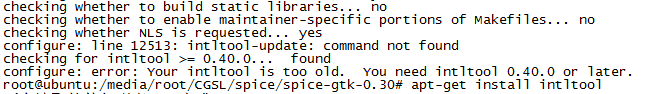
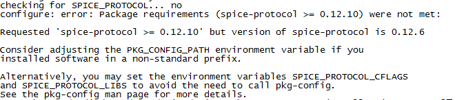

# 在ARM平台上编译Virt  Viewer


## libusb

```
./configure  --host=arm-linux
make
make install
```


## usbredir

```
./configure  --host=arm-linux
make
make install
```


## spice-gtk

```
./configure --host=arm-linux --enable-usbredir=yes --enable-smartcard=no --with-gtk=3.0
make
make install
```


## virt-viewer

```
./configure --host=arm-linux --with-gtk=3.0 --with-spice-gtk
make
make install
```


## 问题：

+ configure: error: cannot run C compiled programs.

在ARM上编译需要指定host参数

```
./configure --host=arm-linux
```


+ configure: error: Your intltool is too old.  You need intltool 0.40.0 or later



```
apt-get install intltool
```


+ configure: error: Package requirements (spice-protocol >= 0.12.10) were not met



下载最新版的spice-protocol（下载地址：[https://packages.debian.org/search?keywords=spice-protocol&searchon=names&suite=all&section=all](https://packages.debian.org/search?keywords=spice-protocol&searchon=names&suite=all&section=all)），并更新即可


+ configure: error: Package requirements (openssl) were not met:

```
apt-get install openssl
apt-get install libssl-dev
```


+ configure: error: Package requirements (gtk+-3.0 >= 2.91.3) were not met

checking for GTK... no
configure: error: Package requirements (gtk+-3.0 >= 2.91.3) were not met:

No package 'gtk+-3.0' found

Consider adjusting the PKG_CONFIG_PATH environment variable if you
installed software in a non-standard prefix.

```
apt-get install libgtk-3-dev
```


+ configure: error: libjpeg not found

```
apt-get install libjpeg-dev
```


+ configure: error: Package requirements (celt051 >= 0.5.1.1) were not met

下载celt051，并编译安装


+ configure: error: Package requirements (libxml-2.0 >= 2.6.0) were not met

```
apt-get install libxml2-dev
```


+ configure: error: spice-gtk requested but not found

spice编译的有问题，ARM 默认使用/bin/sh，使用/bin/bash打包会有问题！！！    


+ 虚拟机 spice://192.168.13.11:5900 的未知图形类型

这个是因为 ARM 版本 virt-viewer 默认只支持VNC的虚拟机，需要重新编译安装virt-viewer
