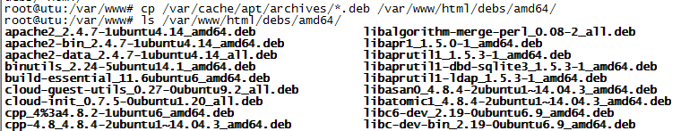
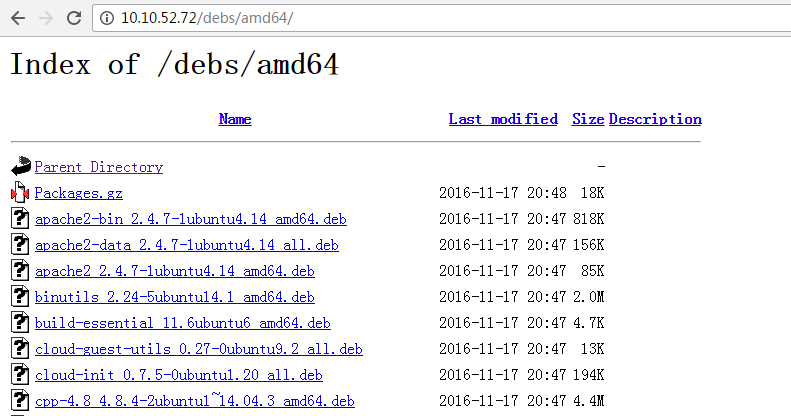
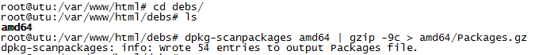

# 创建私有apt-get源

创建私有的apt-get源一共有四步：

1. Install dpkg-dev，apache2
2. Put the packages in apache web directory
3. Run dpkg-scanpackages to create Packages.gz file
4. Add a line to your sources.list pointing at your repository 

## Install dpkg-dev and apache2

安装所需要的工具包。

```
sudo apt-get install dpkg-dev -y
sudo apt-get install apache2 -y
```


## Create Repository directory & Copy packages

将所有的deb包拷贝到apache的web目录下面，并且保证别的机器能够访问到。

```
# mkdir -p /var/www/html/debs/amd64/     
# cp /var/cache/apt/archives/*.deb /var/www/html/debs/amd64/
```



拷贝完成后，可以通过浏览器测试一下是否能够正常访问。




## Create a Packages.gz file

Packages.gz 文件是一个目录文件，里面包含当前源所有的包信息。每次加入新的包都需要重新生成 Packages.gz 文件。

```
# cd /var/www/html/debs/
# dpkg-scanpackages amd64 | gzip -9c > amd64/Packages.gz
```




## Make the repository known to APT

到目前为止，apt-get源已经搭建完成，接下来只需要在其他机器上配置当前私有源即可使用。

```
# vim /etc/apt/sources.list
deb http://10.10.52.72/debs/ amd64/

# apt-get update
```


> 如果要将apt源搭建到centos上，只需要将debs目录拷贝到centos上的web目录下即可，对应的IP地址也需要修改为centos的地址。


参考资料
[http://askubuntu.com/questions/170348/how-to-create-a-local-apt-repository](http://askubuntu.com/questions/170348/how-to-create-a-local-apt-repository)