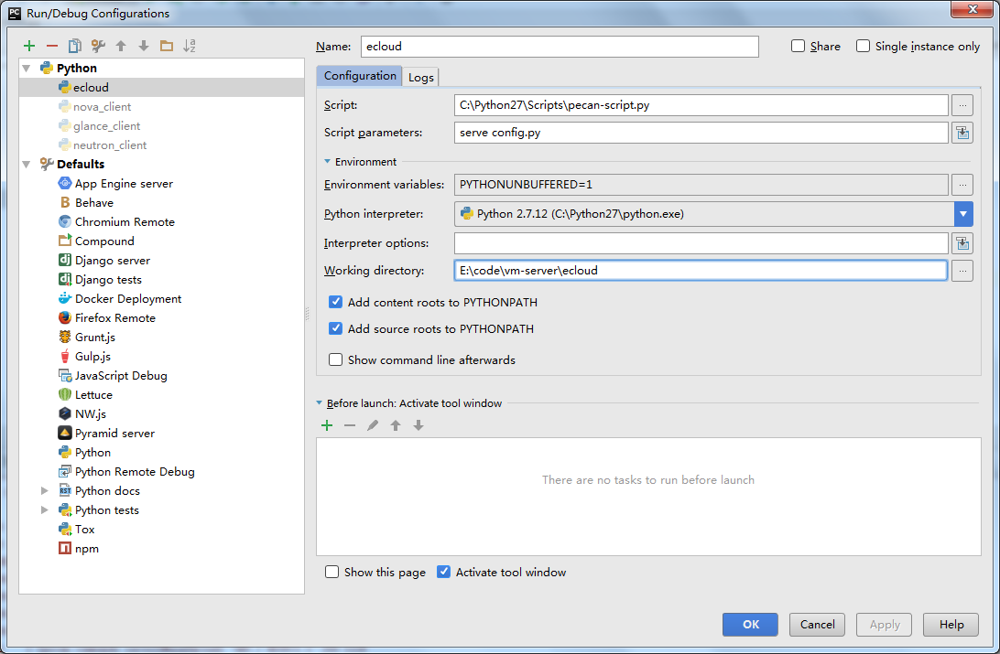

# Pycharm如何调试Pecan代码

在Run/Debug Configurations里面添加一个python配置，并按照下面配置填写：

> script: C:\Python27\Scripts\pecan-script.py
> 
> script parameters: serve config.py
> 
> Working Directory: E:\code\ecloud    [your project directory] 

