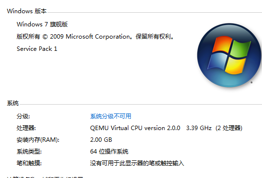
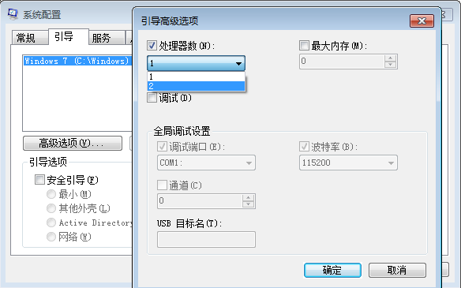
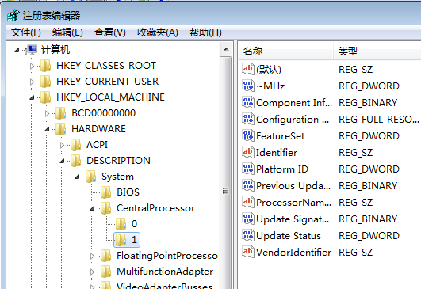
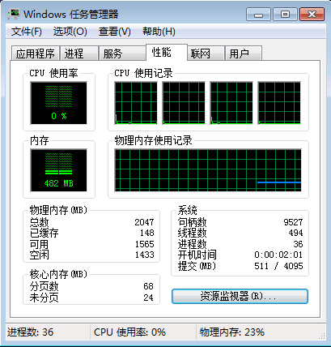

## KVM Windows7设备管理器与任务管理器示CPU核数不一致

使用kvm创建Windows7 x64镜像，上传到openstack，创建云主机后发现系统内的CPU核数和分配的核数不一致。

启动命令：

```
kvm -m 2048 -smp 4 -drive file=win7_x64_pure,if=virtio -net nic,model=virtio -net user -usb -usbdevice tablet -soundhw ac97 -vga qxl -boot d -nographic -vnc :0
```

任务管理器：


计算机基本信息：



设备管理器：


首先想到的是引导时处理器数量做了限制，但是打开引导高级选项的时候发现“处理器数”前面并没有勾上



然后我查看注册表，发现CPU也只有两个，并不是分配的4个



检查到这里我以为是我镜像做的有问题，我做镜像的那台机器是两核的，所以做出来的镜像最多也只能支持两个CPU， 但是细想一下其实是没有道理的。

后来查了资料之后发现是 windows7 自己的问题

> Commercial servers, workstations, and other high-end PCs may have more than one physical processor. Windows 7 Professional, Enterprise, and Ultimate allow for two physical processors, providing the best performance on these computers. Windows 7 Starter, Home Basic, and Home Premium will recognize only one physical processor.

继续查openstack资料后发现max_sockets为4，smp 4 其实等价于 -smp 4,sockets=4,cores=1,threads=1，但是windows7 最多支持两个物理cpu，所以导致的结果就是虚拟机内只能使用两个

```
def get_guest_cpu_topology(self, inst_type, image, preferred_topology, mandatory_topology):
    """:inst_type: object returned from a self.virtapi.instance_type_get() call. Used to determine max vCPU count
        :image_meta: the metadata dict for the root disk image
        :preferred_topology: dict containing three keys: max_sockets, max_cores, max_threads
        :mandatory_topology: dict containing three keys: max_sockets, max_cores, max_threads
         
         Calculate the list of all possible valid topologies for configuring guest machine
         CPU topology within the given constraints. The caller should choose one element
         from the returned list to use as the topology. The returned list will be ordered such
         that it prefers sockets, over cores, over threads. 
         
         Returns list of dicts. Each dict containing three keys: sockets, cores, threads"""
```

所以正确的方式应该是将max_sockets改为2，通过更改cores或者threads来实现多核

```
$ kvm -m 2048 -smp 4,sockets=2,cores=1,threads=2 -drive file=win7_x64_pure,if=virtio -net nic,model=virtio -net user -usb -usbdevice tablet -soundhw ac97 -vga qxl -boot d -nographic -vnc :0
```



参考文档： [Virtualization Driver Guest CPU Topology](https://wiki.openstack.org/wiki/VirtDriverGuestCPUTopology)