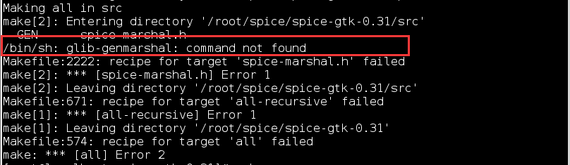
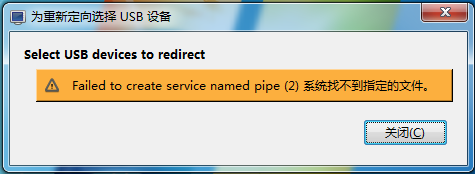

# 使用MinGW编译spice Windows客户端 Virt-Viewer


### Mingw简介

MinGW是Minimalist GUN for Windows的缩写。MinGW提供了一套开发环境，用来开发Microsoft windows本地应用。

MinGW提供了一套完全开源的编程工具集，不需要依赖于第三方的C运行DLL，就可以开发Windows本地应用。当然MinGW还是依赖于microsoft提供的几个操作系统DLL，比如MSVCRT.DLL。

MinGW 编译器提供了对Microsoft C Runtime的以及一些语言特定runtimes的访问。MinGW的Minimalist，就体现在这里，MinGW没有尝试提供一个POSIX runtime 环境。


### 安装Mingw编译环境

```
yum install mingw* libtool* auto-buildrequires intltool glib2-devel icoutils msitools
```


### 编译安装usbredir

```
yum install libusb*

mingw64-configure
mingw64-make
mingw64-make install
```


### 编译安装spice-gtk

```
yum install pixman*
yum install openssl*
yum install gtk2-devel
yum install pulseaudio
yum install pulseaudio-devel
yum install pulseaudio-libs-devel
yum install libjpeg*
yum install libusb*
yum install usbredir*
yum install *gudev*

mingw64-configure --enable-usbredir=yes --enable-smartcard=no --with-gtk=3.0
mingw64-make
mingw64-make install
```


### Virt-Viewer汉化

virtviewer使用的是gettex的方案是标准的linux里国际化的方案，只要在代码里设置好正确的locale，绑定好正确的textdomain就可以了。
对应的汉化文件为po/zh_CN.po，需要修改翻译内容，修改这个文件即可。

修改源码中virt-viewer-util.c文件的方法virt_viewer_util_init

```
setlocale(LC_ALL, "zh_CN");
```

因为为windows系统，还需要修改国际化文件所在的目录（默认为Linux的/usr/share/locale）

```
bindtextdomain(GETTEXT_PACKAGE, "../share/locale/");
```

这样即可完成对virt-viewer的汉化


### 编译安装Virt-viewer

```
yum install libxml*
yum install spice-gtk*

mingw64-configure  --with-gtk=3.0 --with-spice-gtk
mingw64-make
mingw64-make install
```


### 遇到的问题

1. glib-genmashal: command not found



这是因为缺少glib2-devel，yum安装一下就可以了

```
yum install glib2-devel
```


2. Failed to create service named pipe



这是因为usbdk没有安装，到官网下载最新的usbdk安装即可，要注意的是windows7 64位系统，需要安装 **Windows6.1-KB3033929-x64.msu** 更新，否则会导致usb键盘鼠标都不能用！！！

USBDK下载地址：[http://www.spice-space.org/download/windows/UsbDk/](http://www.spice-space.org/download/windows/UsbDk/)


3. 提示mingw-spice-protocal 版本太低

只要下载新版本的mingw-spice-protocal更新一下就可以了

mingw-spice-protocol-0.12.11下载地址：[http://koji.fedoraproject.org/koji/buildinfo?buildID=744124](http://koji.fedoraproject.org/koji/buildinfo?buildID=744124)


4. Virt-Viewer菜单定制

修改share\virt-viewer\ui\virt-viewer.xml文件，删除child，即可删除对应的菜单项


5. 修改标题栏

修改 src\remote_viewer_main.c 文件，将 Remote Viewer改为其他字符串即可。


###　参考

> [http://blog.sina.com.cn/s/blog_7a9cc5930102wb7k.html](http://blog.sina.com.cn/s/blog_7a9cc5930102wb7k.html)
> [http://www.isjian.com/2015/08/spice-kvm-usbredir-qxl-2/](http://www.isjian.com/2015/08/spice-kvm-usbredir-qxl-2/)