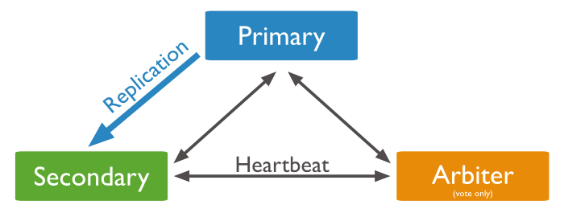
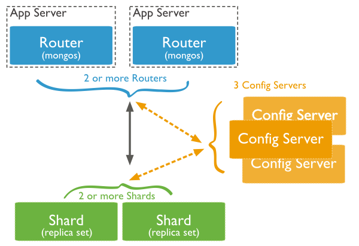

# MongoDB 集群

MongoDB集群实现有三种方式：Master-Slave、Replica Set、Sharding


## 主从架构 (Master-slave)
主从架构一般用于备份或者做读写分离。由两种角色构成：
主(Master)：可读可写，当数据有修改的时候，会将oplog同步到所有连接的salve上去。
从(Slave)：只读不可写，自动从Master同步数据。


对于Mongodb来说，并不推荐使用Master-Slave架构，因为Master-Slave其中Master宕机后不能自动恢复，推荐使用Replica Set

> Replica sets replace master-slave replication for most use cases. If possible, use replica sets rather than master-slave replication for all new production deployments.


### 部署

#### 在master机器上
```
##　dbpath参数可以省略，所以创建的步骤可以省略
# mkdir -p /data/masterdb/
# /usr/bin/mongod --master --dbpath /data/masterdb/
Tue Jan 12 14:13:30.202 [initandlisten] MongoDB starting : pid=17672 port=27017 dbpath=/data/masterdb/ master=1 64-bit host=moose-linux
Tue Jan 12 14:13:30.202 [initandlisten] db version v2.4.9
Tue Jan 12 14:13:30.202 [initandlisten] git version: nogitversion

...

Tue Jan 12 14:14:15.434 [FileAllocator] done allocating datafile /data/masterdb/local.1, size: 1024MB,  took 0.065 secs
Tue Jan 12 14:14:15.484 [initandlisten] ******
Tue Jan 12 14:14:15.484 [websvr] admin web console waiting for connections on port 28017
Tue Jan 12 14:14:15.484 [initandlisten] waiting for connections on port 27017

## Shut down the mongod processes
> db.adminCommand({shutdown : 1, force : true})
```

#### 在slave机器上
```
# mkdir /data/slavedb/ -p
# mongod --slave --source 192.168.50.86:27017 --dbpath /data/slavedb/
Tue Jan 12 14:23:07.257 [initandlisten] MongoDB starting : pid=4061 port=27017 dbpath=/data/slavedb/ slave=1 64-bit host=controller
Tue Jan 12 14:23:07.258 [initandlisten] db version v2.4.9
Tue Jan 12 14:23:07.258 [initandlisten] git version: nogitversion

...

Tue Jan 12 14:23:08.452 [replslave] repl: syncing from host:192.168.50.86:27017
Tue Jan 12 14:23:08.456 [replslave] build index local.me { _id: 1 }
Tue Jan 12 14:23:08.457 [replslave] build index done.  scanned 0 total records. 0.001 secs

```

当slave连上后，master端会有提示
```
Tue Jan 12 14:23:08.395 [initandlisten] connection accepted from 192.168.99.9:34073 #1 (1 connection now open)
Tue Jan 12 14:23:09.463 [slaveTracking] build index local.slaves { _id: 1 }
Tue Jan 12 14:23:09.473 [slaveTracking] build index done.  scanned 0 total records. 0.01 secs
```

在slave连接master的时候，提示错误

```
[initandlisten] exception in initAndListen std::exception: locale::facet::_S_create_c_locale name not valid, terminating
```

这个错误表示 mongod 不能工作在当前系统的 locale 下，只需要修改当前系统的 locale 即可

```
export LC_ALL=C
```

#### 验证

在master端执行命令，插入一条document

```
$ mongo
MongoDB shell version: 2.4.9
connecting to: test
> show dbs
local   1.078125GB
> use user
switched to db user
> db.createCollection("info")
{ "ok" : 1 }
> db.info.insert({"name": "moose", "gender": "male", "age": 20})
> db.info.find()
{ "_id" : ObjectId("56949ea105db20f6c5de6830"), "name" : "moose", "gender" : "male", "age" : 20 }
> db.isMaster()
{
    "ismaster" : true,
    "maxBsonObjectSize" : 16777216,
    "maxMessageSizeBytes" : 48000000,
    "localTime" : ISODate("2016-01-12T06:50:39.783Z"),
    "ok" : 1
}

```

当用户在 master机器上执行插入操作的时候，可以看到slave端会立刻进行同步操作

```
Tue Jan 12 14:33:09.477 [replslave] repl:   checkpoint applied 15 operations
Tue Jan 12 14:33:09.477 [replslave] repl:   syncedTo: Jan 12 14:32:59 56949e1b:1
Tue Jan 12 14:34:17.456 [replslave] resync: dropping database user
Tue Jan 12 14:34:17.471 [replslave] removeJournalFiles
Tue Jan 12 14:34:17.473 [replslave] resync: cloning database user to get an initial copy
Tue Jan 12 14:34:17.475 [FileAllocator] allocating new datafile /data/slavedb/user.ns, filling with zeroes...

...

Tue Jan 12 14:34:17.489 [replslave] build index user.info { _id: 1 }
Tue Jan 12 14:34:17.491 [replslave]      fastBuildIndex dupsToDrop:0
Tue Jan 12 14:34:17.492 [replslave] build index done.  scanned 0 total records. 0.002 secs
Tue Jan 12 14:34:17.493 [replslave] resync: done with initial clone for db: user

... ...

```

在slave端查看是否已经同步

```
$ mongo
MongoDB shell version: 2.4.9
connecting to: test
> show dbs
local   1.078125GB
user    0.203125GB
> use user
switched to db user
> db.info.find()
{ "_id" : ObjectId("56949ea105db20f6c5de6830"), "name" : "moose", "gender" : "male", "age" : 20 }
> 
> db.info.insert({"name": "killer", "gender": "male", "age": 60})
not master
> db.isMaster()
{
    "ismaster" : false,
    "maxBsonObjectSize" : 16777216,
    "maxMessageSizeBytes" : 48000000,
    "localTime" : ISODate("2016-01-12T06:52:47.807Z"),
    "ok" : 1
}

```

官方文档：[https://docs.mongodb.org/manual/core/master-slave/](https://docs.mongodb.org/manual/core/master-slave/)


## 副本集架构（Replica  Set）
基于副本集实现的集群，最简单的模式就是 **一主一从一仲裁** ，和主从模式相比的优点是可以实现自动切换，但是默认只有主节点能用，从节点不能读写。如果想实现读写分离，需要在主节点上设置 slaveok=ok

```
db.getMongo().setSlaveOk();
```



+ 主节点（Primary）

接收所有的写请求，然后把修改同步到所有从节点。一个Replica Set只能有一个主节点，当主节点挂掉后，其他从节点或者仲裁节点会重新选举出来一个主节点。

+ 从节点（Secondary）

同步主节点数据。当主节点Down掉的时候，参与选主。

+ 仲裁节点（Arbiter）

不保有数据，不参与选主，只进行选主投票。

如果参与仲裁的节点为两个的话（一主、一从），那一定是要一个仲裁节点的，否则如果主节点出问题后不会自动选择从节点成为主节点； 如果参与仲裁的节点大于两个（一主，多从），那么仲裁节点是可以省略的， **但是推荐最好要有仲裁节点** 。


### 部署

#### 在主节点/从节点/仲裁节点上

```
# mkdir -p /data/repl/
# mongod --dbpath /data/repl/ --replSet rs000
```

#### 配置主节点

连接到其中一个，配置Replica Set，同时正在执行rs.add的节点被选为Primary 。

```
$ mongo
MongoDB shell version: 2.4.9
connecting to: test
> rs.initiate()
{
    "info2" : "no configuration explicitly specified -- making one",
    "me" : "moose-linux:27017",
    "info" : "Config now saved locally.  Should come online in about a minute.",
    "ok" : 1
}
> rs.add("192.168.99.9:27017")
{ "ok" : 1 }
rs000:PRIMARY> rs.addArb("192.168.99.10:27017")
{ "ok" : 1 }
rs000:PRIMARY> rs.conf()
{
    "_id" : "rs000",
    "version" : 3,
    "members" : [
        {
            "_id" : 0,
            "host" : "moose-linux:27017"
        },
        {
            "_id" : 1,
            "host" : "192.168.99.9:27017"
        },
        {
            "_id" : 2,
            "host" : "192.168.99.10:27017",
            "arbiterOnly" : true
        }
    ]
}
rs000:PRIMARY> 

```

#### 验证

验证主节点

```
rs000:PRIMARY> db.isMaster()
{
    "setName" : "rs000",
    "ismaster" : true,
    "secondary" : false,
    "hosts" : [
        "moose-linux:27017",
        "192.168.99.9:27017"
    ],
    "arbiters" : [
        "192.168.99.10:27017"
    ],
    "primary" : "moose-linux:27017",
    "me" : "moose-linux:27017",
    "maxBsonObjectSize" : 16777216,
    "maxMessageSizeBytes" : 48000000,
    "localTime" : ISODate("2016-01-12T09:21:33.868Z"),
    "ok" : 1
}
rs000:PRIMARY> db.info.count()
0
rs000:PRIMARY> use user
switched to db user
rs000:PRIMARY> db.createCollection("info")
{ "ok" : 1 }
rs000:PRIMARY> db.info.insert({"name":"moose", "age":33})
rs000:PRIMARY> db.info.find()
{ "_id" : ObjectId("5694c8385634027e10f59f6a"), "name" : "moose", "age" : 33 }

```

验证从节点

```
$ mongo
MongoDB shell version: 2.4.9
connecting to: test
rs000:SECONDARY> db.isMaster()
{
    "setName" : "rs000",
    "ismaster" : false,
    "secondary" : true,
    "hosts" : [
        "192.168.99.9:27017",
        "moose-linux:27017"
    ],
    "arbiters" : [
        "192.168.99.10:27017"
    ],
    "primary" : "moose-linux:27017",
    "me" : "192.168.99.9:27017",
    "maxBsonObjectSize" : 16777216,
    "maxMessageSizeBytes" : 48000000,
    "localTime" : ISODate("2016-01-12T09:19:40.972Z"),
    "ok" : 1
}

## 从节点无法读写数据
rs000:SECONDARY> show dbs
local   4.076171875GB
user    0.203125GB
rs000:SECONDARY> use user
switched to db user
rs000:SECONDARY> db.info.find()
error: { "$err" : "not master and slaveOk=false", "code" : 13435 }

```

在同步的时候遇到一个问题，在主节点添加从节点的后，从节点同步主节点数据时用的是主节点的主机名，导致的问题就是节点不够，一直选不了主节点，需要手动在从节点的/etc/hosts文件中添加主节点主机名和IP的映射，仲裁节点也需要添加，不然主节点会一直提示错误

```
Tue Jan 12 17:23:06.718 [rsHealthPoll] replset info 192.168.99.10:27017 thinks that we are down
```

官方文档：[https://docs.mongodb.org/manual/core/replication-introduction/](https://docs.mongodb.org/manual/core/replication-introduction/)


## 分片架构（Sharding）

当数据量比较大的时候，我们可以通过添加CPU、内存的方式来提高性能，当然也可以对数据库进行拆分，使数据分片运行在不同的机器中，以降低CPU、内存和IO的压力。在高吞吐量和大数据的场景下还是很适合使用这个架构的。

> Sharding reduces the number of operations each shard handles. Each shard processes fewer operations as the cluster grows. As a result, a cluster can increase capacity and throughput horizontally.
> For example, to insert data, the application only needs to access the shard responsible for that record.
> Sharding reduces the amount of data that each server needs to store. Each shard stores less data as the cluster grows.
> For example, if a database has a 1 terabyte data set, and there are 4 shards, then each shard might hold only 256 GB of data. If there are 40 shards, then each shard might hold only 25 GB of data.


### 角色

MongoDB的分片架构中有三种角色



+ 查询路由(query routers)

客户端连接路由，路由将用户操作发送到shards上，并将结果返回给用户。路由可以有一个或多个，大部分情况下会有两个以上路由。

+ 配置服务器(config servers)

保存集群的原数据信息，元数据中记录集群数据在哪个shards上，路由通过查询元数据信息来得到对应的shards。

+ 数据分片(shards)

shards 用来存储数据，如果一台shards节点down掉，会影响整个集群的使用，在实际生产环境中，可以将shards配置成replica set来实现高可用。


### 部署

因为节点数量有限，所以在一台机器上启多个mongod，分配不同端口。

#### 启动分片节点

```
# mkdir -p /data/shard1
# mkdir -p /data/shard2
# mongod --port 27011 --shardsvr --dbpath /data/shard1
# mongod --port 27012 --shardsvr --dbpath /data/shard2
... ...

Wed Jan 13 10:18:33.206 [FileAllocator] allocating new datafile /data/shard1/local.0, filling with zeroes...
Wed Jan 13 10:18:33.208 [FileAllocator] done allocating datafile /data/shard1/local.0, size: 64MB,  took 0.002 secs
Wed Jan 13 10:18:33.212 [initandlisten] waiting for connections on port 27011
Wed Jan 13 10:18:33.212 [websvr] admin web console waiting for connections on port 28011
```

#### 启动配置服务器

```
# mkdir -p /data/config1
# mkdir -p /data/config2
# mkdir -p /data/config3
# mongod --port 27021 --dbpath /data/config1/
# mongod --port 27022 --dbpath /data/config2/
# mongod --port 27023 --dbpath /data/config3/
... ...
Wed Jan 13 10:24:08.300 [FileAllocator] done allocating datafile /data/config3/local.ns, size: 16MB,  took 0.001 secs
Wed Jan 13 10:24:08.301 [FileAllocator] allocating new datafile /data/config3/local.0, filling with zeroes...
Wed Jan 13 10:24:08.303 [FileAllocator] done allocating datafile /data/config3/local.0, size: 64MB,  took 0.002 secs
Wed Jan 13 10:24:08.307 [initandlisten] waiting for connections on port 27023
Wed Jan 13 10:24:08.307 [websvr] admin web console waiting for connections on port 28023
```

#### 启动路由节点

```
mongos --port 27031 --configdb 192.168.99.9:27021,192.168.99.9:27022,192.168.99.9:27023
```

#### 在路由上添加分片节点

```
$ mongo --port 27031
MongoDB shell version: 2.4.9
connecting to: 127.0.0.1:27031/test
mongos> sh.addShard("192.168.99.10:27011")
{ "shardAdded" : "shard0000", "ok" : 1 }
mongos> sh.addShard("192.168.99.10:27012")
{ "shardAdded" : "shard0001", "ok" : 1 }
mongos> 
```

#### 验证

客户端可以连接上路由节点进行验证
```
$ mongo --port 27031
MongoDB shell version: 2.4.9
connecting to: 127.0.0.1:27031/test
mongos> use user
switched to db user
mongos> db.createCollection("info")
{ "ok" : 1 }
mongos> db.info.insert({"name":"moose", "age": 31})
mongos> db.info.find()
{ "_id" : ObjectId("5695b786fbe7834b1f4157a8"), "name" : "moose", "age" : 31 }
mongos> use books
switched to db books
mongos> db.author.insert({"name":"xiaoma", "age":40})
mongos> sh.status()
--- Sharding Status --- 
  sharding version: {
    "_id" : 1,
    "version" : 3,
    "minCompatibleVersion" : 3,
    "currentVersion" : 4,
    "clusterId" : ObjectId("5695b60e2249fa30dea79b58")
}
  shards:
    {  "_id" : "shard0000",  "host" : "192.168.99.10:27011" }
    {  "_id" : "shard0001",  "host" : "192.168.99.10:27012" }
  databases:
    {  "_id" : "admin",  "partitioned" : false,  "primary" : "config" }
    {  "_id" : "test",  "partitioned" : false,  "primary" : "shard0000" }
    {  "_id" : "user",  "partitioned" : false,  "primary" : "shard0000" }
    {  "_id" : "books",  "partitioned" : false,  "primary" : "shard0001" }

## 如果down掉一台机器
mongos> show dbs
Wed Jan 13 11:27:11.240 listDatabases failed:{
    "code" : 11002,
    "ok" : 0,
    "errmsg" : "exception: socket exception [CONNECT_ERROR] for 192.168.99.10:27012"
} at src/mongo/shell/mongo.js:46
```

当切换到某个不存在的数据库时，mongo会自动创建一个shard：

```
Wed Jan 13 10:33:02.701 [conn1] couldn't find database [user] in config db
Wed Jan 13 10:33:02.847 [conn1]      put [user] on: shard0000:192.168.99.10:27011

Wed Jan 13 10:37:03.564 [conn1] couldn't find database [books] in config db
Wed Jan 13 10:37:03.717 [conn1]      put [books] on: shard0001:192.168.99.10:27012
```

在shards节点上验证

```
$ mongo --port 27011
MongoDB shell version: 2.4.9
connecting to: 127.0.0.1:27011/test
> show dbs
local   0.078125GB
test    (empty)
user    0.203125GB
> use user
switched to db user
> db.info.find()
{ "_id" : ObjectId("5695b786fbe7834b1f4157a8"), "name" : "moose", "age" : 31 }
```

路由节点启动后命令行一直提示：

```
Wed Jan 13 10:53:53.595 [Balancer] distributed lock 'balancer/moose-linux:27031:1452652045:1804289383' acquired, ts : 5695bc412249fa30dea79c4f
Wed Jan 13 10:53:53.732 [Balancer] distributed lock 'balancer/moose-linux:27031:1452652045:1804289383' unlocked. 
```

这个是正常的日志，告诉你balancer正在运行

如果两台服务器时间不同步，会提示下面的错误，最好启用一台ntp服务器来同步时间

```
caught exception while doing balance: error checking clock skew of cluster
```


官方文档：[https://docs.mongodb.org/manual/core/sharding-introduction/](https://docs.mongodb.org/manual/core/sharding-introduction/)