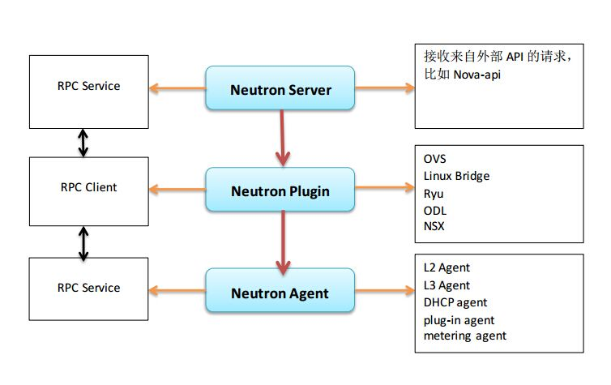
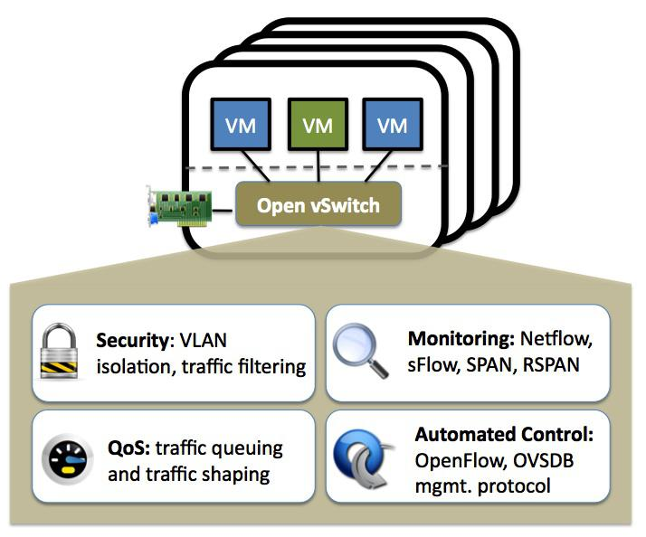

## Neutron架构

### Neutron架构

1）位于最上层的Neutron Server充当一个门派中的“掌门人”角色（RESTful Server），负责接受来自外部门派（项目）的API请求，比如Nova API创建网络的请求。
2）位于中间层的Neutron plugin充当一个门派中的“信使”角色，负责传达最高层指令给下面的人。
3）位于下层的Neutron Agent充当一个门派中“干活”角色，负责执行一些具体的任务和操作。

类似于各个计算、存储节点被虚拟化为计算、存储资源池，Openstack所在的整个物理网络在Neutron中也被虚拟化为网络资源池。通过对网络资源的划分和可扩展性，Neutron能够为每个租户提供独立的虚拟网络环境。

Neutron分别提供了二层（L2）vSwitch交换和三层（L3）Router路由抽象的功能，对应于物理网络环境中的交换机和路由器实现。具体实现了如下功能：

+ Router：为租户提供路由、NAT等服务。
+ Network：对应于一个真实物理网络中的二层局域网（VLAN），从租户的的角度而言，是租户私有的。
+ Subnet：为网络中的三层概念，指定一段IPV4或IPV6地址并描述其相关的配置信息。它附加在一个二层Network上，指明属于这个network的虚拟机可使用的IP地址范围。

1. **Linux虚拟网络**
Neutron中最为核心的工作便是对二层物理网络network的抽象与管理。

虚拟机的网络功能由虚拟网卡（vNIC）提供，Hypervisor可以为每个虚拟机创建一个或多个vNIC，从虚拟机的角度出发，这些vNIC等同于物理的网卡，为了实现与传统物理网络一样的网络功能，与物理网卡一样，Switch也被虚拟化成虚拟交换机（OpenvSwitch），各个vNIC连接在vSwitch的端口（br-int）上，最后这些vSwitch通过物理服务器的物理网卡访问外部的物理网络。

对一个虚拟的二层网络结构而言，主要是完成两种网络设备的虚拟化，即物理网卡和交换设备。在Linux环境下网络设备的虚拟化主要有以下几种形式：
1）TAP/TUN/VETH
提到Neutron的虚拟网络功能实现，不得不先提基于Linux内核级的虚拟设备。

TAP/TUN/VETH是Linux内核实现的一对虚拟网络设备，TAP工作在二层，收发的是 MAC 层数据帧；TUN工作在三层，收发的是 IP 层数据包。Linux 内核通过TAP/TUN设备向绑定该设备的用户程序发送数据，反之，用户程序也可以像操作硬件网络设备一样，通过TAP/TUN设备接收数据。

基于TAP设备，实现的是虚拟网卡的功能，当一个TAP设备被创建时，在Linux的设备文件目录下将会生成一个对应的字符设备文件（/dev/tapX文件），而运行其上的用户程序便可以像使用普通文件一样打开这个文件进行读写。

VETH设备总是成对出现的，接收数据的一端会从另一端发送出去，理解为一根虚拟的网线即可。

2）Linux Bridge
Linux Bridge（Linux内核实现的网桥）是工作在二层的虚拟网络设备，功能类似于物理的交换机。

它的实现原理是，通过将其他Linux网络设备绑定到自身的Bridge上，并将这些设备虚拟化为端口。为什么我们已经有了OVS，还要有Linux Bridge 呢？这是因为Linux Bridge实现了qbrxxx设备，提供了OVS无法支持的安全组（Security Group）功能。

3）Open vSwitch
对于云计算中的虚拟网络而言，交换设备的虚拟化是很关键的一环，vSwitch负责连接vNIC与物理网卡，同时也桥接同一物理服务器内的各个VM的vNIC。

因此，我们可以像配置物理交换机一样，将接入到OpenvSwitch（需要指出的是在多个以上时，vSwitch是分布式虚拟交换机）上的各个VM分配到不同的VLAN中实现网络隔离，并且，我们也可以在OVS端口上为VM配置QOS，同时OVS也支持包括NetFlow、sFlow等标准的管理接口和协议。从而，通过这些接口可以实现VM流量监控的任务。

运行在云环境中各种或相同虚拟化平台上的多个vSwitch实现了分布式架构的虚拟交换机。一个物理服务器上的vSwitch可以透明的与其他服务器上的vSwitch连接通信。

关于OVS更加详细的内容，请参阅其他资料。

2. **Neutron RPC**
RPC是neutron中跨模块进行方法调用的很重要的一种方式，主要包括client端和server端。client端用于发出rpc消息，server端用于监听消息并进行相应处理。
1）Agent 端RPC
在dhcp agent、 l3 agent、 firewall agent以及metering agent的main函数中都能找到类似的创建一个Agent rpc服务端的代码。
2）plugin端的rpc
3）neutron-server端的rpc
具体的RPC实现，请参阅源代码和其他资料。

###　Neutron 虚拟网络
1.　**Neutron网络资源**
通过对上面的了解，我们已经知道了Neutron通过L3虚拟的Router提供路由器功能，通过L2（二层）虚拟的network/subnet/port 提供物理二层网络的功能，并且其二层network分别由linux bridge和OpenvSwitch等共同实现。

在L2中，Neutron还提供了一个重要的网络资源抽象Port，其作为虚拟交换机上的一个虚拟端口。当一个port被创建时，默认情况下，会为它分配其指定subnet中可用的IP。

对于L2层虚拟network而言，Linux bridge 和OpenvSwitch只是实现了虚拟网络的底层机制，并不能代表物理网络的拓扑类型。而目前，neutron支持如下的网络类型来映射到真正的物理网络中：
    + Flat
    + VLAN
    + GRE
    + VXLAN

除了上述的L2和L3层虚拟资源外，Neutron还提供了更高层次的一些服务，主要有FWaaS、LBaaS和VPNaaS等。

2. **Neutron Plugin**
与其他项目服务不同，Neutron只有一个主要的服务进程neutron-server，它运行于网络控制节点上，提供RESTful API作为访问Neutron的入口，neutron-server接收到的用户HTTP请求最终由遍布于计算节点和网络节点上的各种agent来完成。

Neutron提供的众多API资源对应了前面所讲的各种虚拟网络资源。其中L2的抽象network/subnet/port可以被认为是核心资源API（Core API），其他层次的抽象，包括router以及众多的高层次服务则是扩展资源API（Extension API）。

为了更容易的进行扩展，Neutron项目利用Plugin的方式组织代码，每一个Plugin支持一组API资源并完成特定的操作，这些操作最终由Plugin通过RPC调用相应的Agent来完成。

这些Plugin又被做了一些区分，一些提供基础二层虚拟网络支持的Plugin称为Core Plugin。而Core Plugin之外的其他Plugin则被称为Service Plugin，比如提供防火墙服务的FWaaS等。
Agent一般专属于某个功能，用于使用物理网络设备或一些虚拟化技术来完成某些实际的操作，比如实现router具体操作的L3 agent。

因为各种Core Plugin的实现之间存在很多重复的代码，比如对数据库的CRUD等操作。自H版起，Neutron实现了一个ML2 Core Plugin，它采用了更加灵活的结构进行实现，通过Driver的形式对现有的各种Core Plugin提供支持，因此可以说ML2 Plugin的问世意在取代目前的Core Plugin。

3. **Neutron API**
Neutron将基于各种虚拟网络资源得到的API资源分为核心资源（Core API）和扩展资源（Exten API）两种。Core API只对应于L2层的network/subnet/port三种抽象。其余的各层抽象都属于Extension API的范围。Neutron API实现的主要代码位于/neutron/api目录。

4. **Neutron-server**
作为Neutron中的唯一一个服务进程，neutron-server承担着接收用户RESTful API请求并分发处理的任务。主要代码位于neutron/services目录。

5. **ML2 plugin**
ML2 plugin被社区提出来的目的是用于取代所有的Core Plugin，它采用了更加灵活的结构进行实现。作为一个Core plugin，ML2 自然会实现network/subnet/port这三种核心资源，同时它也实现了包括Port Binding等在内的部分扩展资源。

ML2实现了网络拓扑类型（Flat、VLAN、VXLAN、GRE）和底层虚拟网络（linux bridge、OVS）分离的机制，并分别通过Driver的形式进行扩展。其中，不同的网络拓扑类型对应着type driver，由type manager管理，不同的网络实现机制对应着Mechanism Driver（比如Linux bridge、OVS、NSX等），由Mechanism Manager管理。

详情，请参阅neutron.plugins.ml2.drivers.mech_agent文件中的AgentMechanismDriverBase类。

6. **Port Binding扩展**
Extension API有两种方式扩展现有的资源：一种是为network/port/subnet增加属性，比如port binding扩展。另外一种就是增加一些新的资源，比如VPNaaS等。

Extension API的定义都位于neutron/extension目录，他们的基类以及一些公用的代码则位于neutron/api/extension.py文件。其中Extension Descriptor类是所有Extension API的基类。添加新的资源时需要实现get_resources( )方法，而扩展现有的资源时，则只需要实现get_extended_resources( ) 方法。

7.　**OpenvSwitch Agent**

ML2 Plugin的主要工作是管理虚拟网络资源，保证数据正确无误，具体物理设备的设置则由Agent来完成，这里我们宏观阐述下Neutron项目中的OVS Agent。

基于Plugin rpc提供的信息，OVS Agent负责在计算节点和网络节点上，通过对OVS虚拟交换机的管理将一个Network映射到物理网络，这需要OVS Agent去执行一些linux 网络和OVS相关的配置与操作，Neutron通过如下两个库提供了最为基础的操作接口，从而可以通过Linux Shell命令完成OVS的配置。
比如：

+ ovs_lib.py
通过shell执行各种ovs-vsctl操作。
代码目录：neutron/agent/common

+ ip_lib.py
通过linux的br-ctl命令操作Linux的veth、router、namespace等。
代码目录：neutron/agent/linux/

主要是完成如下的一些工作：
1）agent初始化
2）agent和Plugin RPC的通信
3）br-int创建与初始化
4）br-eth初始化
5）br-tun初始化
6）创建Tunnel Port
7）分配LVID（Local VLAN ID）
8）L2 population

8. **Service plugin**
Neutron中除了network、port、subnet这三种二层的核心资源外，其他的都被作为Extension API进行实现，随着ML2的成熟和发展，Extension API 的实现演变为两种方式，一种是实现在某个Core plugin内，比如ML2内的port binding、Security Group等。

另一种就是使用Service plugin的方式，去实现FWaaS、LBaaS、VPNaaS等高级服务。
代码目录：neutron/services

至此，我们已经从宏观上认识了Neutron架构，接下来的则是自己考究了。