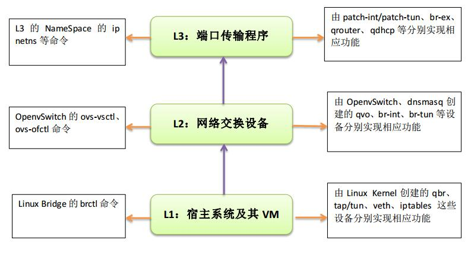
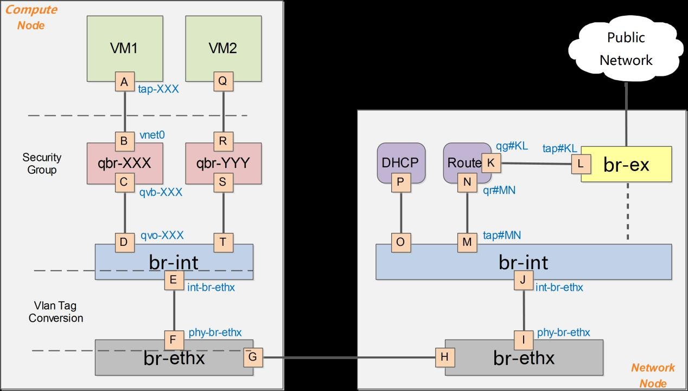
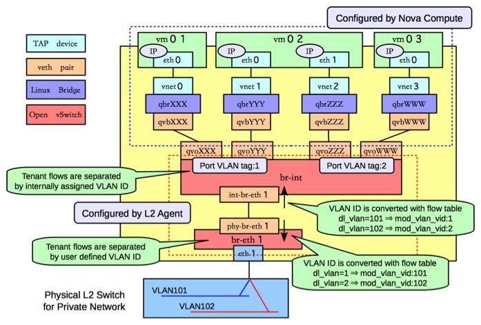

## Neutron

Neutron是将传统的物理硬件设备（如网线、网卡、服务器、交换机、路由器等）按照TCP/IP的四个层次架构（数据链路层、网络层、传输层、应用层），通过软件编程的方式，予以全部虚拟化、软件化和抽象化。

> 在Neutron虚拟网络中，除了Neutron本身命令外，还包括了Linux Bridge的brctl命令；OpenvSwitch的ovs-vsctl、ovs-ofctl命令和L3的NameSpace的ipnetns等命令。

### OpenStack Neutron网络连接测试
需要注意的是，在vlan模式下，vlan tag的转换是在br-int和br-ethx两个网桥上进行。即br-int负责从int-br-ethX过来的包（带外部vlan）转换为内部vlan，而br-ethx负责从phy-br-ethx过来的包（带内部vlan）转化为外部的vlan。
同时，在VLAN模式下，没有br-tun通道网桥。


1. 执行nova list 查看VM对应的名称和VM_UUID。
VM默认存放于路径：/var/lib/nova/instances/
```shell
# nova list
```

2. 执行nova show $VM_UUID，查看VM所在的openstack compute node信息和instance name
```shell
# nova show $VM_UUID
```

3. 查看VM在哪个计算节点上
```shell
# nova-manage vm list | grep vm-name
```

4. 执行virsh list 查看VM状态，执行virshdumpxml instance-XXXX查找文件中关于“Bridge”信息，查找tap的ID和网桥qbrXXXX
```shell
# virsh list
# virsh dumpxml instance-00000052  
</controller>
<interface type='bridge'>
<mac address='fa:16:3e:3e:da:f1'/>
<source bridge='qbrc08d85da-69'/>   #OVS实现安全组的网桥
<target dev='tapc08d85da-69'/>#虚拟网卡设备
<model type='virtio'/>              #虚拟网卡驱动
<alias name='net0'/>#虚拟网卡别名
<address type='pci' domain='0x0000' bus='0x00' slot='0x03' function='0x0'/>
```

这里，我们结合一张官网的图，来予以剖析:


从图中，我们可以知道：
eth0连接的目的设备是：tapc08d85da-69，别名为net0。TAP设备桥接到网桥qbrXX上（都由Linux kernel创建）。qbr设备是因为不能在TAP设备上配置iptables实现安全组（SecurGroup）而增加的设备。
eth0对应的tapc08d85da-69，桥接到的网桥为qbrc08d85da-69。

5. 执行brctl show查看网桥qbr上的接口信息，找到tap设备和qvbXXXX接口
```shell
# brctl show
qbrc08d85da-69      8000.3a04f8f4bda2   no      qvbc08d85da-69
                            tapc08d85da-69
```
这里，可以看到网桥qbrc08d85da-69，上面有接口qvbc08d85da-69和tapc08d85da-69。

这里出现的qvbXXX和qvoXXX是一对veth pair devices，是一对虚拟的网卡设备或虚拟的网线，用来连接Linux bridge网桥和Open vSwitch设备。名字的涵义是q-quantum、v-veth、b-bridge；o-open、vswitch（quantum年代的遗留）。

6. 查看qvb设备的驱动是否是veth类型
```shell
# lshw -class network|more
```

7. 查看qvb接口的对端peer_ifindex:number
```shell
# ethtool -S qvbc08d85da-69
NIC statistics:
    peer_ifindex: 15
```

8. 找到peer_ifindex:number对应的接口qvoXXX
```shell
# ip link | grep 15:
15: qvoc08d85da-69: <BROADCAST,MULTICAST,PROMISC,UP,LOWER_UP>mtu 1500 qdiscpfifo_fast master ovs-system state UP mode DEFAULT qlen 1000
link/ether 4e:99:15:01:1b:07 brdff:ff:ff:ff:ff:ff
```
qvbXXX和qvoXXX是一对veth设备，成对出现的。可以根据*ethtool -S* 查看对端的number，并且根据*ip link | grep number*：查看到对应的veth设备名称（即qvo）。
qvb是quamtumveth bridge
qvo是quamtumveth open vswitch
qvoXXX设备连接到了Open vSwitch设备的br-int集成网桥上


9. 通过Open vSwitch中的命令ovs-vsctl port-to-brqvoXXX查看qvoXXX设备所属的bridge
```shell
# ovs-vsctl port-to-br qvoc08d85da-69
br-int
```

10. 查看所有的网桥
```shell
# ovs-vsctl list-br
bond-br
br-int
```

11. 查看OVS Bridge上面有哪些端口
```shell
# ovs-vsctl list-ports br-int
int-bond-br
qvo077eac35-ed
qvo1ee66407-69
qvo40816622-cf
 
# ovs-vsctl list-ports bond-br
eth3
phy-bond-br
```
int-bond-br和phy-bond-br端口是用来连接Open Vswitch设备的br-int和bond-br（即br-ethX）网桥。另外，VLAN ID的转换是发生在br-int和bond-br网桥的端口int-bond-br和phy-bond-br上面的。

从br-int进来的数据包，其VLAN ID 会被转换为内部的VLAN ID。同理，从网络出去的数据包，经过phy-bond-br，VLAN ID会将内部VLAN ID 转化为外部VLAN ID。

12. 通过ethtool -S 命令查看br-int的对端设备number；并通过ip link |grep number查看br-int的对端设备（即phy-bond-br）
```shell
# ethtool -S int-br-eth2
NIC statistics:
     peer_ifindex: 50
# ip link | grep 50:
50: phy-br-eth2: <BROADCAST,MULTICAST,UP,LOWER_UP> mtu 1500 qdisc pfifo_fast master ovs-system state UP mode DEFAULT group default qlen 1000

```

13. 查看phy-bond-br连接到的虚拟外部网桥
```shell
# ovs-vsctl port-to-br phy-bond-br
bond-br
```

14. 查看外部网桥bond-br（即br-ethX桥）上的端口
```shell
# ovs-vsctl list-ports bond-br
eth3
phy-bond-br
```

关于本例子中的bond-br外部网桥和物理网口ethX的关系是：VM数据包要到外部物理网络中，必须依靠真正的物理网卡。
这种关联，需要通过手动方式创建，这里是：
```shell
# ovs-vsctl add-port bond-br eth3
```

基于上述数据通信流程，这样整个VM的数据链路便完全打通了。从VM的端口到qvoXXX接口的信息及网桥和端口的连接情况，再结合tcpdump命令查看网络流量和OVS OpenFlow协议能够清楚的掌握和梳理Neutron网络的连接架构，作为网络分析的依据，为故障排除提供坚实的基础。


