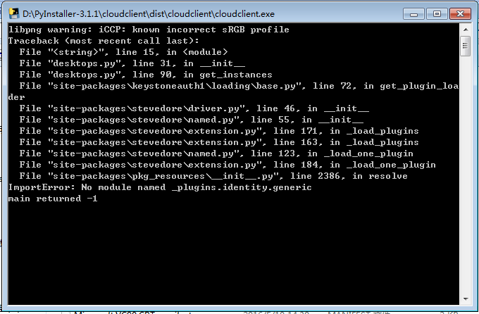
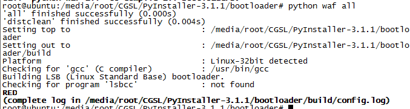

# Pyinstaller 使用


## 使用pyinstaller打包openstack包
由于pyinstaller不支持pkg_resources，打包完运行的时候总是提示setuptools包有问题，可以等打包完成后手动将对应的包拷贝过去(dist-info目录也需要)。

可以正常打包，打包后运行的时候提示错误信息如下，可以看到错误在 "login.py", line 5，这一行刚好是引用keystoneclient的包

```
Traceback (most recent call last):
  File "<string>", line 6, in <module>
  File "D:\PyInstaller-3.1.1\PyInstaller\loader\pyimod03_importers.py", line 389
, in load_module
  File "login.py", line 5, in <module>
  File "D:\PyInstaller-3.1.1\PyInstaller\loader\pyimod03_importers.py", line 389
, in load_module
  File "site-packages\keystoneclient\__init__.py", line 36, in <module>
  File "site-packages\pbr\version.py", line 465, in version_string
  File "site-packages\pbr\version.py", line 460, in semantic_version
  File "site-packages\pbr\version.py", line 446, in _get_version_from_pkg_resour
ces
  File "D:\PyInstaller-3.1.1\PyInstaller\loader\pyimod03_importers.py", line 389
, in load_module
  File "site-packages\pbr\packaging.py", line 33, in <module>
  File "D:\PyInstaller-3.1.1\PyInstaller\loader\pyimod03_importers.py", line 389
, in load_module
  File "site-packages\setuptools\command\develop.py", line 11, in <module>
  File "D:\PyInstaller-3.1.1\PyInstaller\loader\pyimod03_importers.py", line 389
, in load_module
  File "site-packages\setuptools\command\easy_install.py", line 51, in <module>
  File "D:\PyInstaller-3.1.1\PyInstaller\loader\pyimod03_importers.py", line 389
, in load_module
  File "site-packages\setuptools\package_index.py", line 206, in <module>
  File "site-packages\pkg_resources\__init__.py", line 943, in require
  File "site-packages\pkg_resources\__init__.py", line 829, in resolve
pkg_resources.DistributionNotFound: The 'setuptools' distribution was not found
and is required by the application
main returned -1
```


还会报keystone的一个包错误 ，貌似是不支持下划线开头的包，使用旧版本的client就没有问题了。



```
d:\PyInstaller-3.1.1>python pyinstaller.py -n cloudclient --noconsole --upx-dir d:\upx391w d:\cloudclient\main.py -i logo.ico
```

-n NAME  指定生成文件的名称
--noconsole    文件运行的时候不会出现cmd黑窗口
--upx-dir PATH    指定upx目录路径，使用upx压缩
main.py    程序的入口文件，如果有多个文件也只要入口文件就行，其余的会自动引入
-i ICON   指定生成文件使用的图标

如果有ini配置文件、或者有图片等文件，可以等pyinstaller打包后直接拷贝到dist目录中即可使用


## pyinstaller in arm

pyinstaller 默认只支持x86架构，直接在arm平台打包，会提示没有预编译的bootloader

> Fatal error: PyInstaller does not include a pre-compiled bootloader for your
platform. 


这个问题只要在arm平台上重新生成一下bootloader即可解决，官方文档：[http://pythonhosted.org/PyInstaller/bootloader-building.html](http://pythonhosted.org/PyInstaller/bootloader-building.html)


### 生成bootloader

cd bootloader
python ./waf distclean all

这边提示lsbcc程序不存在，需要手动安装lsb-build-cc，具体步骤如下




### 准备环境

Development tools

```
sudo apt-get install build-essential 
```


### 安装lsbcc

installed the LSB tools
在/etc/apt/sources.list文件中加入源

deb http://ftp.linux-foundation.org/pub/lsb/repositories/debian lsb-4.0 main

```
sudo apt-get update
sudo apt-get install lsb lsb-build-cc
```

也可以直接下载安装（下载地址：[http://ftp.linuxfoundation.org/pub/lsb/bundles/released-4.0.0/sdk/](http://ftp.linuxfoundation.org/pub/lsb/bundles/released-4.0.0/sdk/)）

```
tar -xvzf lsb-sdk-4.0.3-1.ia32.tar.gz
cd lsb-sdk
./install.sh
```


### 遇到的问题

+ PyInstaller.compat.FileNotFoundError: Path or glob "/usr/include/python2.7/pyconfig.h" not found or matches no files.

需要安装python-dev

```
apt-get install build-essential python-dev
```


# Inno Setup 打包
pyinstaller打包后的目录可以使用inno setup 打包为可安装的exe文件，需要注意的是桌面快捷方式和安装依赖程序。

```
; 脚本由 Inno Setup 脚本向导 生成！
; 有关创建 Inno Setup 脚本文件的详细资料请查阅帮助文档！

#define MyAppName "Cloud Client"
#define MyAppVersion "1.0.0603"
#define MyAppPublisher "深圳市华讯方舟科技有限公司"
#define MyAppURL "http://www.huaxunchina.cn/"
#define MyAppExeName "cloudclient.exe"

[Setup]
; 注: AppId的值为单独标识该应用程序。
; 不要为其他安装程序使用相同的AppId值。
; (生成新的GUID，点击 工具|在IDE中生成GUID。)
AppId={{BCD20A87-97CF-4D18-931A-FA2CBC2529BF}
AppName={#MyAppName}
AppVersion={#MyAppVersion}
;AppVerName={#MyAppName} {#MyAppVersion}
AppPublisher={#MyAppPublisher}
AppPublisherURL={#MyAppURL}
AppSupportURL={#MyAppURL}
AppUpdatesURL={#MyAppURL}
DefaultDirName={pf64}\{#MyAppName}
DisableProgramGroupPage=yes
OutputDir=C:\Users\Administrator\Desktop
OutputBaseFilename=cloudclient
SetupIconFile=D:\我的文件\Downloads\Desktop_Folder_128px_1125934_easyicon.net.ico
Compression=lzma
SolidCompression=yes

[Languages]
Name: "chinesesimp"; MessagesFile: "compiler:Default.isl"

[Tasks]
Name: "desktopicon"; Description: "{cm:CreateDesktopIcon}"; GroupDescription: "{cm:AdditionalIcons}"; Flags: checkablealone
Name: "quicklaunchicon"; Description: "{cm:CreateQuickLaunchIcon}"; GroupDescription: "{cm:AdditionalIcons}"; Flags: checkablealone

[Files]
Source: "D:\PyInstaller-3.1.1\cloudclient\dist\cloudclient\cloudclient.exe"; DestDir: "{app}"; Flags: ignoreversion
Source: "D:\PyInstaller-3.1.1\cloudclient\dist\cloudclient\*"; DestDir: "{app}"; Flags: ignoreversion recursesubdirs createallsubdirs
; 注意: 不要在任何共享系统文件上使用“Flags: ignoreversion”

[Icons]
Name: "{commonprograms}\{#MyAppName}"; Filename: "{app}\{#MyAppExeName}"
Name: "{commondesktop}\{#MyAppName}"; Filename: "{app}\{#MyAppExeName}"; Tasks: desktopicon
Name: "{userappdata}\Microsoft\Internet Explorer\Quick Launch\{#MyAppName}"; Filename: "{app}\{#MyAppExeName}"; Tasks: quicklaunchicon

[Run]
Filename: "{app}\usbdk\usbdk_x64.msi"; Description: "Install USB Redirect Tool"; StatusMsg: "正在安装USB重定向工具"; Flags: shellexec waituntilterminated
Filename: "{app}\{#MyAppExeName}"; Description: "{cm:LaunchProgram,{#StringChange(MyAppName, '&', '&&')}}"; Flags: nowait postinstall skipifsilent

```

