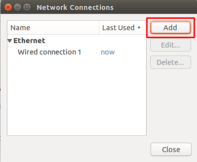
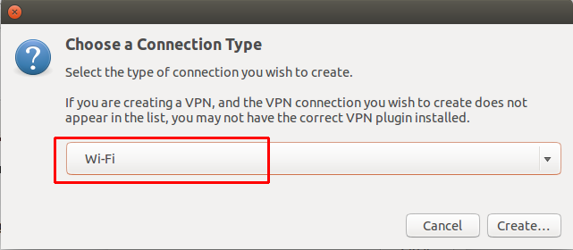
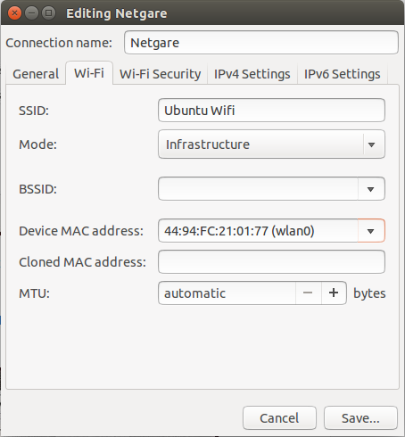
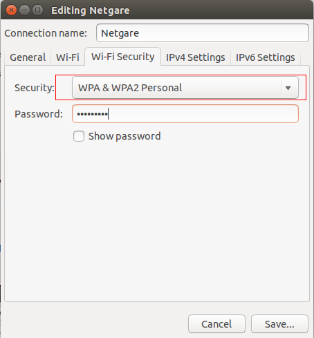
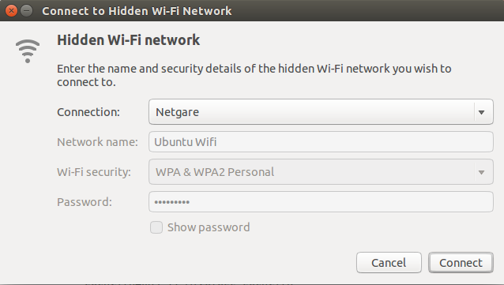
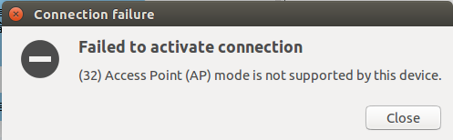

# Ubuntu安装Netgare WNDA3100v2 USB网卡驱动

## 1. 插上usb网卡
使用lsusb命令可以看到对应的设备信息
```shell
$ lsusb
Bus 004 Device 002: ID 8087:8000 Intel Corp. 
Bus 004 Device 001: ID 1d6b:0002 Linux Foundation 2.0 root hub
Bus 003 Device 002: ID 8087:8008 Intel Corp. 
Bus 003 Device 001: ID 1d6b:0002 Linux Foundation 2.0 root hub
Bus 002 Device 001: ID 1d6b:0003 Linux Foundation 3.0 root hub
Bus 001 Device 004: ID 413c:2107 Dell Computer Corp. 
Bus 001 Device 003: ID 04ca:0061 Lite-On Technology Corp. 
Bus 001 Device 006: ID 0846:9011 NetGear, Inc. WNDA3100v2 802.11abgn [Broadcom BCM4323]
Bus 001 Device 001: ID 1d6b:0002 Linux Foundation 2.0 root hub
```
使用iwconfig命令会发现找不到wlan的信息
```shell
$ iwconfig
eth0      no wireless extensions.

lo        no wireless extensions.
```


## 2. 安装网卡驱动
驱动下载地址：[2955302-Broadcom_bcm43xx_USB_32_64bit_v3.tar.gz](http://media.cdn.ubuntu-de.org/forum/attachments/37/11/2955302-Broadcom_bcm43xx_USB_32_64bit_v3.tar.gz)
或者 [http://pan.baidu.com/s/1i3zx06x](http://pan.baidu.com/s/1i3zx06x)

下载后解压会得到下面几个文件
```shell
$ ll
total 1448
drwxrwx--- 2 moose moose   4096  3月 15  2012 ./
drwxr-xr-x 6 moose moose   4096 11月  4 13:54 ../
-rwxrwx--- 1 moose moose  41078  6月  7  2011 bcmn43xx32.inf*
-rwxrwx--- 1 moose moose 632576  9月  4  2010 bcmn43xx32.sys*
-rwxrwx--- 1 moose moose  41078  3月 15  2012 bcmn43xx64.inf*
-rwxrwx--- 1 moose moose 747008  9月  4  2010 bcmn43xx64.sys*
```

安装ndisgtk
```shell
$ sudo apt-get install ndisgtk
```

安装驱动
```shell
$ sudo ndiswrapper -i bcmn43xx64.inf
```

检查驱动是否安装成功
```shell
$ ndiswrapper -l
bcmn43xx64 : driver installed
    device (0846:9011) present
```


## 3. 加载驱动模块
成功安装驱动之后就可以用命令加载驱动模块
```shell
$ sudo depmod -a
$ sudo modprobe ndiswrapper
```

加载的过程中可以使用tail命令来查看错误信息
```shell
$ tail -f /var/log/messages
```

加载完成后再次执行iwconfig命令，即可以看到新加的wlan0信息
```shell
$ iwconfig
eth0      no wireless extensions.

wlan0     IEEE 802.11g  ESSID:off/any  
          Mode:Managed  Frequency:2.412 GHz  Access Point: Not-Associated   
          Bit Rate:300 Mb/s   Tx-Power:32 dBm   
          RTS thr:2347 B   Fragment thr:2346 B   
          Power Management:off
          Link Quality:0  Signal level:0  Noise level:0
          Rx invalid nwid:0  Rx invalid crypt:0  Rx invalid frag:0
          Tx excessive retries:0  Invalid misc:0   Missed beacon:0

lo        no wireless extensions.
```

现在就可以通过NetworkManager来连接无线网络了。

> 参考地址: [https://help.ubuntu.com/community/WifiDocs/Driver/Ndiswrapper](https://help.ubuntu.com/community/WifiDocs/Driver/Ndiswrapper)

****


# Ubuntu共享无线网络
## 1. 禁用Wifi
去掉Enable-Wifi前面的对钩

## 2. 添加Wifi网络
打开网络面板，点击 **Edit Connections** 
--> 点击 **Add** 按钮 

--> 选择连接类型为 **Wifi** 

--> 输入 **Connection name** 、**SSID**， 选择Mode为 **Infrastructure**, Device MAC Address 选择为 **wlan0** 

--> 点击Wi-Fi Security面板，选择Security为 **WPA & WPA2 Personal** 并输入密码 

--> 点击IPv4 Settings面板，选择Method为 **Shared to other computers** 

--> 点击Save保存


## 3. 编辑wifi配置文件
将 **mode=infrastructure** 改为 **mode=ap**
```shell
# Netgare 为你刚才配置的Connection name
$ sudo vim /etc/NetworkManager/system-connections/Netgare
[connection]
id=Netgare
uuid=da436c01-1a3f-4d9d-910c-04d3c68ef5f0
type=802-11-wireless

[802-11-wireless]
ssid=Ubuntu Wifi
mode=infrastructure
mac-address=44:94:FC:21:01:77
security=802-11-wireless-security

[802-11-wireless-security]
key-mgmt=wpa-psk
psk=123456789

[ipv4]
method=shared

[ipv6]
method=auto
```

## 4. 启用无线网络
点击 **Enable Wifi**, 连接刚创建的wifi网络( *Ubuntu Wifi* )。如果找不到刚创建的网络，就点击 **Connect to Hidden Wi-Fi Network...**， 选择刚创建的wifi网络( *Ubuntu Wifi* )即可。


不过，楼主的测试并没有成功…… 
提示 *(32) Access Point (AP) mode is not supported by this device.*



> 参考地址:
> [3-ways-create-wifi-hotspot-ubuntu](http://ubuntuhandbook.org/index.php/2014/09/3-ways-create-wifi-hotspot-ubuntu/)
> [How-do-I-create-hotspots-in-Ubuntu-14-04](https://www.quora.com/How-do-I-create-hotspots-in-Ubuntu-14-04)